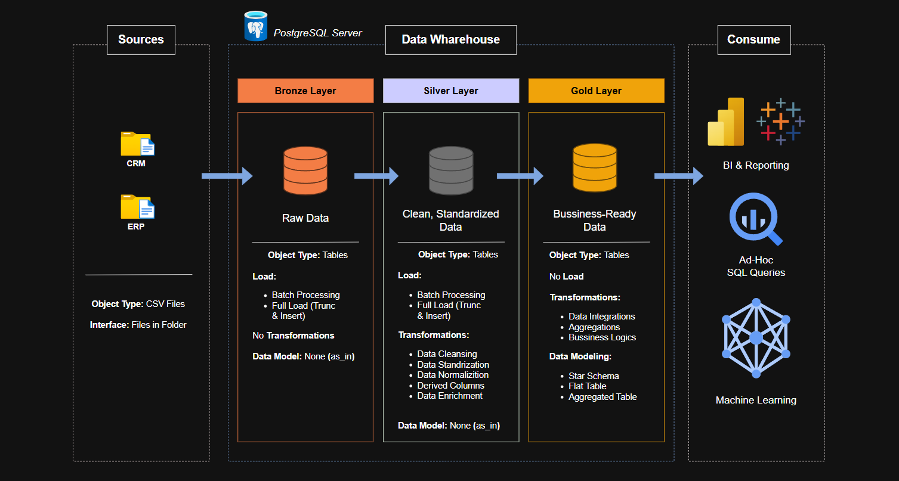
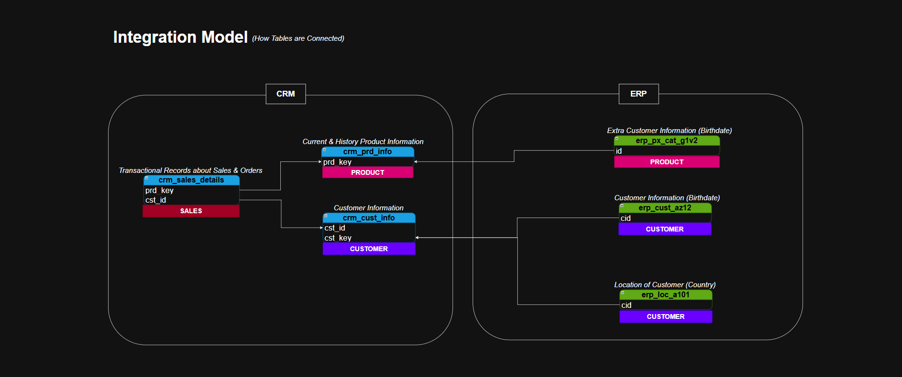
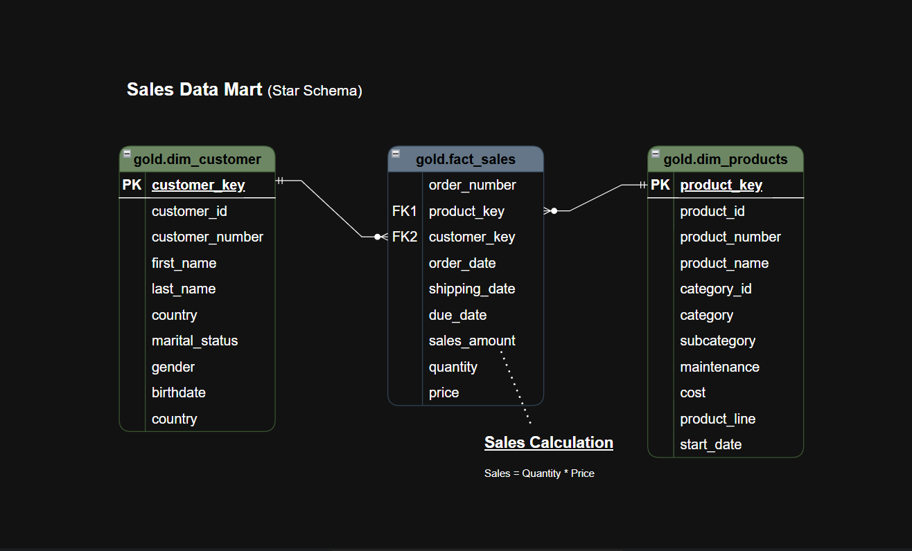

# Data Warehouse Automation & Reporting Project

Welcome to the **Data Warehouse Automation & Reporting System** repository! 🚀 <br>
This project showcases a fully **automated data warehouse and analytics workflow**. The warehouse is built with **SQL**, while **Python, Pandas, Matplotlib, and Seaborn** are used for reporting and visualizations. The entire **ETL process is executed in one click via batch file processing**, generating CSV reports and updated notebooks. It demonstrates practical **data engineering, automation, and analytics skills** in a hands-on portfolio project.


---

## 🏗️ Data Architecture

This project implements a Medallion Architecture with three layers: **Bronze**, **Silver**, and **Gold**.<br><br>


---

## 🔗 Integration Model Diagram

This diagram illustrates how data from CRM and ERP sources is integrated at the logical level. It shows the relationships between transactional, customer, and product tables across both systems, highlighting how disparate data sources are connected and unified for downstream processing.



- **Bronze Layer**: Captures raw data directly from source systems (CSV files) into a SQL Server database.
- **Silver Layer**: Focuses on cleaning, standardizing, and transforming data to prepare it for analytics.
- **Gold Layer**: Contains business-ready, analytics-optimized data modeled in a star schema.

---

## 🔄 Automated Data Flow Diagram

This diagram summarizes the journey of data from CRM and ERP sources through the Bronze and Silver layers, where it is refined and integrated. The process culminates in the Gold layer, producing analytical tables ready for business intelligence and reporting.  

**New Feature:** The entire ETL process is **automated** via a batch file, so all layers and reporting outputs are refreshed with a single execution.  


---

## ⭐ Star Schema Model Diagram

The star schema diagram represents the final analytical data model in the Gold layer. It demonstrates how fact and dimension tables are structured for efficient querying and reporting, with clear relationships between sales transactions, customers, and products.<br><br>



---

## 🚀 How to Run the Full Automated ETL Pipeline

After building and testing the automation scripts for all three layers ([Bronze](./scripts/01_bronze/), [Silver](./scripts/02_silver/), and [Gold](./scripts/03_gold/)), you can now run the **entire ETL process and reporting system in one click** using the `run_full_etl.bat` file.  

**Sample Output:**

```bat
========================================================
 Starting Full ETL Process...
========================================================

[1/3]  Loading Bronze Layer...
TRUNCATE TABLE
COPY ...
Load completed successfully.

[2/3] Loading Silver Layer...
INSERT ...
Silver Layer Transformation Completed Successfully.

[3/3] Loading Gold Layer...
CREATE VIEW ...
Gold Layer views created successfully.

[4/4] Generating Reports...
Customer_Report.csv generated successfully.
Product_Report.csv generated successfully.
Notebook_Report.ipynb updated successfully.

========================================================
 Full ETL & Reporting Process Completed Successfully
 Total Time Taken: 35 seconds
========================================================
Press any key to continue . . .
```
With this, your data warehouse and analytics reports are fully refreshed and ready for stakeholders. ✅


---

## 📖 Project Overview

Key components of this project:

1. **Layered Data Architecture**: Modern data warehouse design using Bronze, Silver, and Gold layers.
2. **ETL Pipelines**: Automated extraction, transformation, and loading of data from source files.
3. **Data Modeling**: Creation of fact and dimension tables for efficient analytical queries.
4. **Analytics & Reporting**: Generates customer and product CSV reports and updates Jupyter notebooks automatically.

🎯 This repository is ideal for those looking to demonstrate skills in:
- SQL Development
- Data Architecture
- Data Engineering  
- ETL Pipeline Development  
- Data Modeling  
- Data Analytics & Reporting

---

## 🛠️ Useful Resources & Tools

- **[datasets/](./datasets/)**  
- **[Anaconda Download (Windows)](https://www.anaconda.com/products/distribution#windows)**  
- **[Anaconda Download (Mac/Linux)](https://www.anaconda.com/products/distribution#macos)**  
- **[pgAdmin Download](https://www.pgadmin.org/download/)**  
- **[SQL Server Management Studio (SSMS)](https://learn.microsoft.com/en-us/sql/ssms/download-sql-server-management-studio-ssms)**  
- **[GitHub](https://github.com/)**  
- **[Draw.io](https://www.draw.io/)**


---

## 🚦 Project Requirements

### Data Engineering

**Goal:**
Build a modern data warehouse that consolidates sales data for analytics and reporting.

**Scope:**
- **Data Sources:** Import data from ERP and CRM systems (CSV format).
- **Data Quality:** Clean and resolve issues before analysis.
- **Integration:** Merge both sources into a unified, analysis-friendly model.
- **Focus:** Use only the latest data; historization is not required.
- **Documentation:** Provide clear data model documentation for business and analytics users.

---

### 📈 Analytics & Reporting

**Goal:**  
Develop automated analytics and visual reports using **Python, Pandas, Matplotlib, and Seaborn** to deliver actionable insights on:  
- Customer behavior and segmentation  
- Product performance and trends  
- Sales patterns and time-based analysis  

**Automation:**  
Reports are generated automatically as **CSV files** and **notebooks with visualizations**, enabling easy review and decision-making.

---

## 📂 Repository Structure

```
SQL-Data-Warehouse-Project/
│
├── datasets/                  # Source datasets (ERP and CRM CSV files)
│   ├── source_crm/            
│   └── source_erp/            
│
├── docs/                      # Documentation and diagrams
│   ├── bronze-layer-diagram.png
│   ├── Data_Architecture.png
│   ├── data_catalog.md
│   ├── gold-layer-diagram.png
│   ├── integration_model_diagram.png
│   ├── naming_conventions.md
│   ├── silver-layer-diagram.png
│   └── star_schema_model_diagram.png
│
├── scripts/                   # ETL and transformation scripts
│   ├── 01_bronze/             
│   ├── 02_silver/             
│   └── 03_gold/               
│
├── Automated Reports/                   # Automated output reports
│   ├── Customer_Report.csv
│   ├── Product_Report.csv
│   ├── Analytics_&_Report.ipynb
│   └── Report.html
│
├── tests/                     # Data quality and validation scripts
├── run_full_etl.bat           # Batch file to run the full ETL pipeline and reporting
├── README.md                  
├── LICENSE                    
└── ...                        
```

---


## 🛡️ License

This project is licensed under the [MIT License](LICENSE). You are free to use, modify, and share this project with proper attribution.

## 👤 About Me

Hi, I'm **Shashwat Singh**. I'm a passionate **Data Analyst** with a **B.Tech** in **Computer Science and Engineering** (specialization in **Big Data Analytics**) from SRM Institute of Science and Technology. I thrive on working with data in all its forms, from **business intelligence** and **reporting** to **ETL processes**, **automation**, and **advanced analytics**. My expertise spans the full **data lifecycle**, enabling impactful insights and efficient data-driven solutions.


Let's stay in touch! Feel free to connect with me :


[](https://www.shashwatanalyst.online/)
[](https://www.linkedin.com/in/shashwat-singh-bb2730357/)
[](https://x.com/ShashwatSi48402)
[](https://leetcode.com/u/fclDlbfku9/)
[](https://www.hackerrank.com/profile/shashwat98k)


